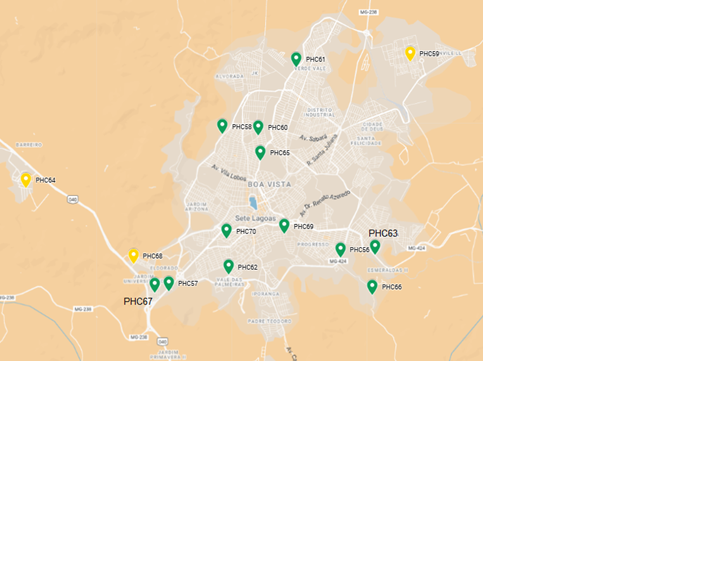

# Projeto de Localização de Unidades de Saúde

Este projeto utiliza o **GLPK (GNU Linear Programming Kit)** para resolver um problema de localização de unidades de saúde no município de Sete Lagoas – MG. O modelo foi construído com base em critérios de equidade, cobertura, custo e capacidade instalada, visando à organização racional da Rede de Atenção Primária à Saúde (APS).

---

## 📁 Estrutura do Projeto

```
meu_projeto_glpk/
├── model/
│   └── hc-closest.mod         # Modelo matemático
├── data/
│   └── hc-closest.dat         # Dados de entrada
├── README.md                  # Este arquivo
```

---

## 📌 Objetivo

O objetivo é propor um plano de localização para unidades de saúde que atenda à demanda da população, respeitando os critérios de cobertura geográfica e capacidade das equipes, com foco principal na APS.

---

## ▶️ Como Executar

1. Instale o GLPK: https://www.gnu.org/software/glpk/

2. Execute o modelo no terminal com:

```bash
glpsol -m model/hc-closest.mod -d data/hc-closest.dat
```

3. O GLPK retornará no terminal a alocação ótima das unidades, os custos envolvidos e os fluxos entre níveis de atenção.

---

## 📊 Resultados da Modelagem

### 3.6. Análise dos Resultados

O modelo foi executado com sucesso e encontrou solução ótima, respeitando todas as restrições. A solução assegura cobertura universal da APS no município. Os resultados são organizados em:

- Visão financeira do plano
- Distribuição das novas unidades
- Equipes formadas e composição
- Diagnóstico das capacidades utilizadas
- Reflexões operacionais e estratégicas

### 3.6.1. Caracterização Financeira do Plano

**Custo Total:** R$ 164.271.649,48

| Natureza do Custo                          | Valor (R$)         |
|-------------------------------------------|--------------------|
| Custo Logístico                            | 923.115,85         |
| Custo Fixo Unidades Existentes [E]         | 17.209.420,00      |
| Custo Fixo Novas Unidades [C]              | 539.658,00         |
| Custo de Nova Equipe [C]                   | 654.024,00         |
| Custo Variável                              | 144.945.431,63     |
| **Custo Total**                             | **164.271.649,48** |

**APS específica:** R$ 50.633.053,25 (dentro do orçamento de R$ 90.399.976,00)

---

### 3.6.2. Novas Unidades Criadas




Foram ativadas 12 de 15 possíveis novas unidades. A seguir, algumas delas com suas coordenadas:

| Identificador | Coordenadas                     |
|---------------|----------------------------------|
| PHC56         | 19°28'36.5"S 44°13'04.3"W       |
| PHC57         | 19°29'13.6"S 44°16'25.6"W       |
| PHC58         | 19°26'20.1"S 44°15'22.2"W       |
| PHC59         | 19°25'00.0"S 44°11'42.7"W       |
| ...           | ...                              |

---

### 3.6.3. Novas Equipes

Foram criadas 15 novas equipes, com custo de R$ 624.024,00. Exemplo da composição por unidade:

| Unidade | Nº eSFs | ME1 | EF1 | TE1 | ACS | DE1 | TD1 |
|---------|---------|-----|-----|-----|-----|-----|-----|
| PHC56   | 2       | 2   | 2   | 2   | 8   | 2   | 2   |
| PHC57   | 1       | 1   | 1   | 1   | 4   | 1   | 1   |
| ...     | ...     | ... | ... | ... | ... | ... | ... |

---

### 3.6.4. Equipes Existentes

- Médicos, enfermeiros e técnicos de enfermagem em quantidade adequada.
- Déficit de profissionais da **Equipe de Saúde Bucal**.
- Distribuição irregular de **Agentes Comunitários de Saúde**.
- Equipes multiprofissionais (eMulti) estão presentes de forma adequada, favorecidas por políticas federais recentes.

---

### 3.6.5. Capacidade Utilizada

#### APS – Unidades com utilização quase total (média de 100%)

| Unidade | Capacidade Total | Utilizada | % Utilizado |
|---------|------------------|-----------|-------------|
| PHC1    | 3000             | 3000      | 100%        |
| PHC2    | 6000             | 6000      | 100%        |
| ...     | ...              | ...       | ...         |

⚠️ Nota: a capacidade máxima operacional (4.500 pessoas por UBS) permite **margem de segurança de até 50%**.

#### SHC – Subutilização aparente (de 2% a 75%)

#### THC – Grande subutilização no modelo

---

## 📌 Considerações Finais

O modelo oferece uma solução técnica e financeiramente viável para a expansão da APS em Sete Lagoas. Ele respeita o orçamento da atenção primária, propõe cobertura universal e apresenta estrutura escalável. Pode ser aplicado em outros municípios com características semelhantes.

---

## 📜 Licença

MIT

## ✉️ Contato

Thiago Mendanha  
📧 [mbm.thiago@gmail.com](mailto:mbm.thiago@gmail.com)
